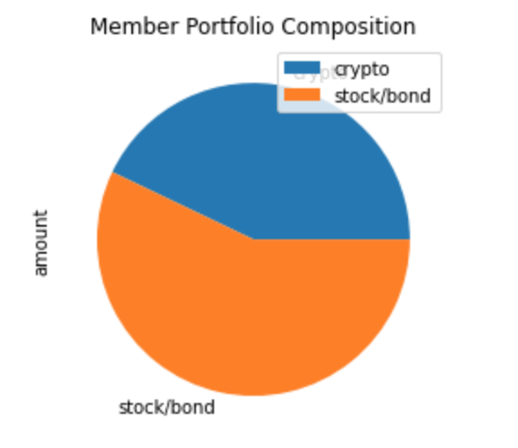
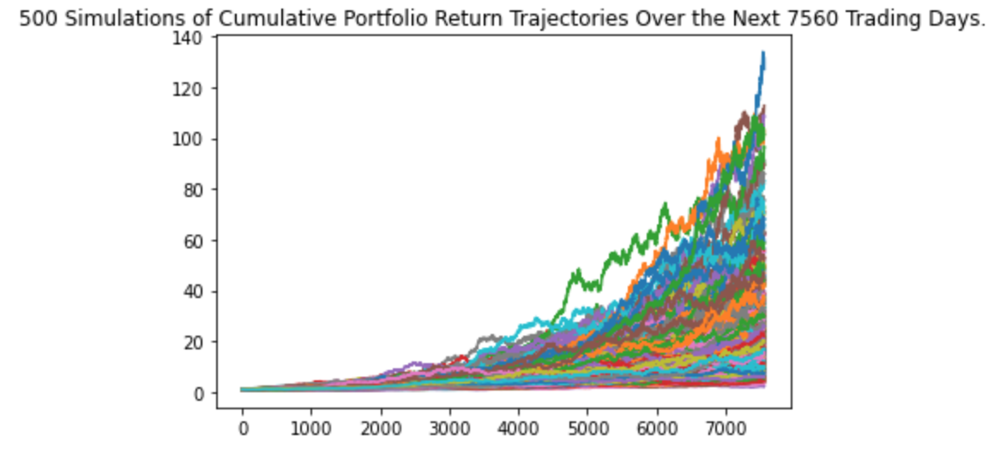
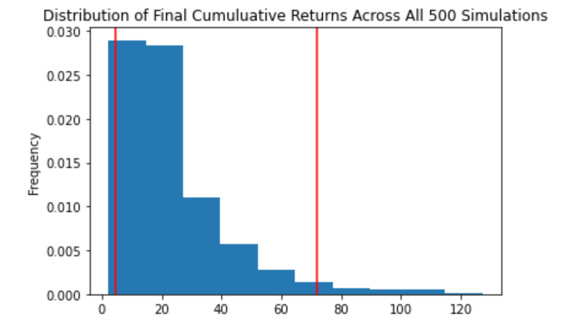

# Financial Planning Tools

This Jupyter lab notebook provides the following financial planning tools:
1. An Emergency Fund planner that helps visualize current portfolio value.  This tool determines if there is adequate reserves for an emergency fund.
2. A Retirement planner that forecasts the value of a 60/40% stock/bond portfolio over 30 years and an 80/20% stock/bond portfolio over 10 years.

---

## Technologies

This analysis is a Jupyter lab notebook that makes use of the following Python libraries:
* Pandas
* Pathlib
* Python Requests
* Python JSON
* Python Dotenv
* Matplotlib
* Alpaca SDK/Alpaca Trade API

---

## Installation Guide

To use this notebook:
* Install Jupyter lab Version 3.0.14 and Python 3.7.
* Install Python Requests, Python JSON, Python Dotenv, Matplotlib, and Alpaca SDK/Alpaca Trade API to you Python 3.7 environment.
* Open the notebook in Jupyter lab and you can run the analysis.

---

## Examples

Here are examples of the type of information this notebook provides:

### Emergency Fund Planning
```
The current value of the BTC holding is $ 41136.00.
The current value of the ETH holding is $ 12067.73.
The current cryptocurrency wallet balance is $ 53203.73.

The current value of the bond portfolio is $ 23074.00.
The current value of the stock portfolio is $ 47712.50.
The current value of the stock and bond portion of the portfolio is $ 70786.50.
The total current value of the portfolio is $ 123990.23.

```

```
Congratulations!  You have more than enough saved to fund an emergency fund portfolio.
```

### Retirement Planning



```
There is a 95% chance that a 60/40 stocks/bonds portfolio with an initial value of $ 70786.50
will be worth $ 323048.29 to $ 5087105.61 after 30 years.
```

---

## Contributors

Michael Danenberg

---

## License

MIT
